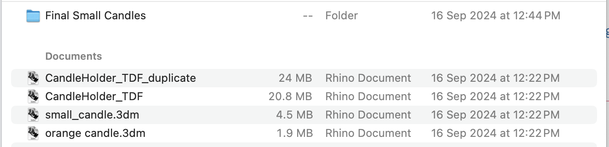

# Hello, my name is Chantal Martinez!
Welcome to my GitHub repository! 

# Outline
[week 1](README.md#week-1-example-report-1)

[week 2](README.md#week-2-example-report-2)

[week 3](README.md#week-3-example-report-3)

---

# Week 3: Report 1 #
## Week of 09/19/2024

This week was very hectic, trying to understand everything from the project, figuring out what to design, actually using Grasshopper to create somehting I really wanted an already designed, and more! Here are a couple of pictures of the process of Project 01, along with the video I created for this!

Link: https://youtu.be/Aso4vXevdKo 

While I think this was a very fast paced project, I am still open to learning more about Grasshopper and excited to use it in a more complex manner, it will take me some time to grasp how these graphs and flow work. As a designer, it can be challenging not to manipulate my design directly like I can in Rhino or SolidWorks. I am happy to have discovered that leveraging Grasshopper allowed me to iterate and refine my ideas more effectively, improving my overall design process.

After doing my project and video, I wish I had showed more information of all the iterations it took for me to finally land on a design. It definelty was a longer process than what is shown on my video and would really like to get some tips on how to condense this information and be able to still showcase all that I want without leaving important things out. I would like to learn how to explain my diagrams easier on video while still stayingon the 3 min constraint. 

Here are some pictures of the different files created prior to defining the route I was gong to go with and while finding out what works for printing. When working on Grasshopper I found out it was way easier to iterate and doing all this process I did in Rhino while defining what was feasible to print, hold the candle, etc. 

---

# Week 2: Report 1 #
## Week of 09/12/2024

The homework assignment for this week was kind of confusing at first, but after a series of Grasshopper tutorials online and playing around with Grasshopper... I was able to understand the basics of the flow of how the program works (a little bit at least). I feel like it was helpful to mess around with the example files and see what changed in the model once altering the different parameters and baking. I have used Rhino before, so baking was not a term I was familiar with, but it makes sense when you model in Grasshopper that the object or whatever is being created is instantly tranfered into the Rhino file from the Grasshopper graph. While playing around, the program gave me an error once I edited the phone parameters to the actual dimensions of my phone. The center of gravity was off, the stand was not doing its desired function. Below are some picturs of my progress:

Here is a visual/diagram of what I understood from the example files of the phone stand:

And here is another visual of my thinking process while trying to create something: 

In class on Monday we had a Grasshopper demo that was more "clear" (still a work in progress to understand how it works) than many tutorials. I have still been watching tutorials that show some "tips and tricks" to helpe first time user get familiar with the commands and all you can do in the program. While it is still hard to grasp all the commands, paraments, etc. I am confident that I will learn how to do basic models soon. Here is a picture of the progress I made with the "live tutorial" that TJ led the other day...

I feel that I need more practice to figure out what is the gemometry (not sure this is the correct term) that is available in Grasshopper. I have had a difficult time differentiating between types of commands. For example, I want to do a a circle, but there are so many options... how do I know which one is the one I want? I feel that it will be a trial and error learning experience and then it will be total muscle memory. Fingers crossed! Very excited to develop this knowledge and skil in this new program. 

Examples: 

---

# Week 1: Report 1 #
## Week of 09/05/2024

This week it was a mix of going back to basics and learning things. After a year or so of not being in a studio, using CAD, or physically prototypiong, it feels good to be back. After refreshing my knowledge on Rhino, laser cutting, and 3D printing, I decided to test out the laser cutter for this first week. 

I went the simple route creating coasters for my new apartment and they turned out pretty good! I worked in Rhino and then moved onto Illustartor, where I faced some issues with having a newer version of the program. With some guidance from Cody Glen, I was able to succesfully cut my coasters. See pictures of my design below!

After cutting the coasters I felt happy to be back in a workshop, yet felt the necessity to seal them/clear coat them to make these functional... here are some pictures of the process...

Moving forward, I see myself working on very interesting projects and getting familiar with both old and new machines/tools. All the tools we are being offered and pushed to use seem to be very useful and purposeful for our future as designers. 

Additionally, I am very interested in the healthcare industry. Medical tech, wearables, everything related to it... I recently read on the news about this doctor in China who performed surgery on a patient from kilometers away. I really finds this fascinating, find the link below:

_https://www.hindustantimes.com/trending/doctor-removes-patient-s-lung-tumor-while-operating-machine-from-5-000-km-away-video-surfaces-101722674450882.html_
