# Hello, my name is Chantal Martinez!
Welcome to my GitHub repository! 

# Outline
[week 1](README.md#week-1-example-report-1)

[week 2](README.md#week-2-example-report-2)

[week 3](README.md#week-3-example-report-3)

[week 4](README.md#week4-example-report-4)

[week 5](README.md#week5-example-report-5)

[week 6](README.md#week6-example-report-6)

[week 7](README.md#week7-example-report-7)

[week 8](README.md#week8-example-report-8)

[week 9](README.md#week9-example-report-9)

---

# Week 9: Report 9 #
## Week of 10/31/2024

**Reflection**

Hello, this week we successfully finished project 2 and went on to the third project of the semester. Here are my experiments in ZeroWidth:

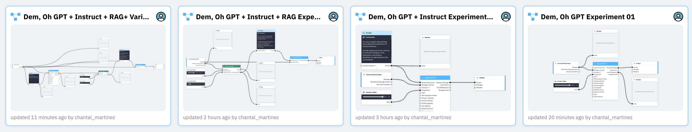

_Dem, Oh GPT Experiment 01_

_Dem, Oh GPT + Instruct Experiment 01_

_Dem, Oh GPT + Instruct + RAG Experiment 01_

_Dem, Oh GPT + Instruct + RAG+ Variable Experiment 01_

I was getting an error in this experiment, but with Luryn's help we figured out that my variables in the instructions were in lowercase and not in caps. That fixed it and I was able to see the correct vairables: Chantal Martinez, Skills (Design), and Year (2020). 

Postman & API Responses

After working on the experiments, I followed TJ's instrusctions to go into POstman and I was able to see the API reponses created while I used Postman to do so. 

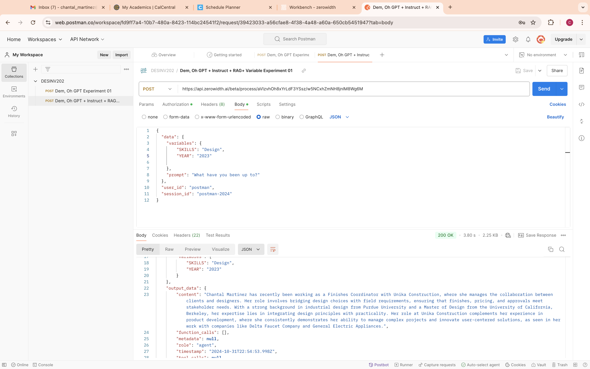
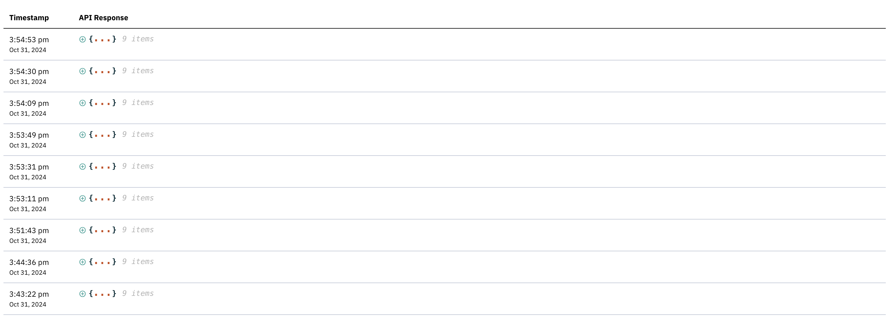

**Speculations**

I felt 

---

# Week 8: Report 8 #
## Week of 10/24/2024

**Reflection**

This was a very work intensive week in which my team and I worked together to make our interactive Jellyfish successfully work. I modeled the Jellyfish, focused on getting the servo motor to work and fit and designed pieces that could be easily modified if any changes needed to be made. Indeed we had to make various alterations as we made progress due to some changes of sensors. Thankfully, eveyrthing worked out and even by changing out the FSR for and APDS9960 sensor which Kaylee sucessfully connected to P5.js to display an interactive background that  enhanced the sensory experience of our Jellyfish. Here are some pictures of the 3D model and a final group picture of the assembled and working prototype! 

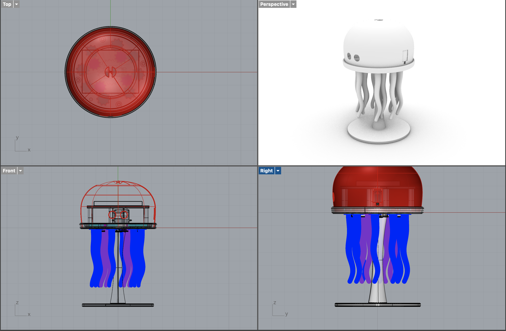
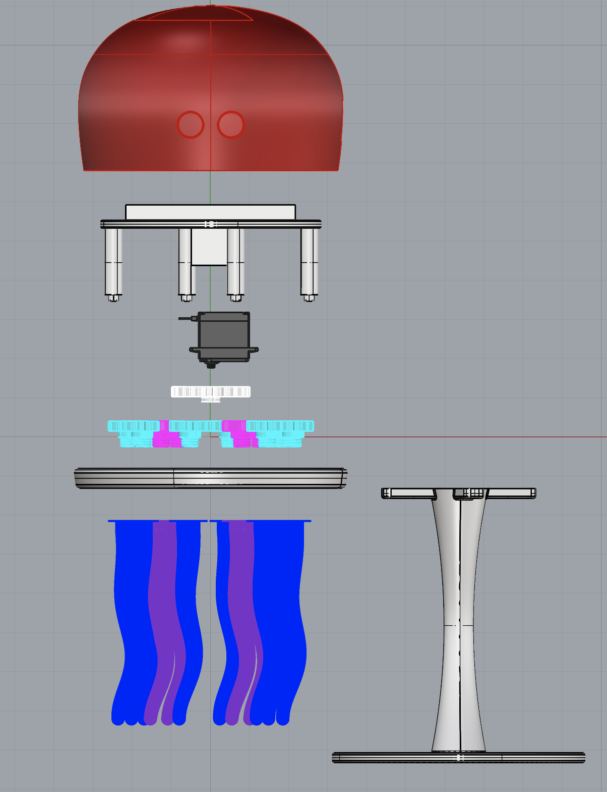
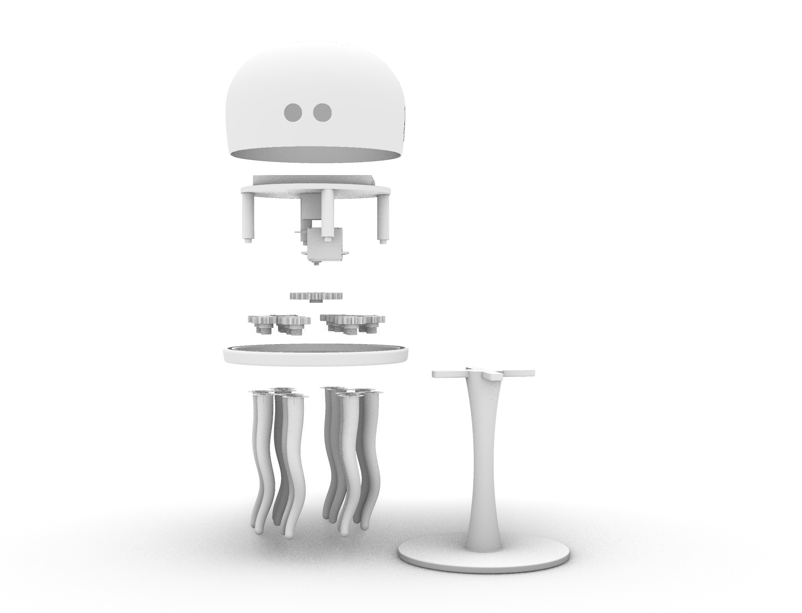
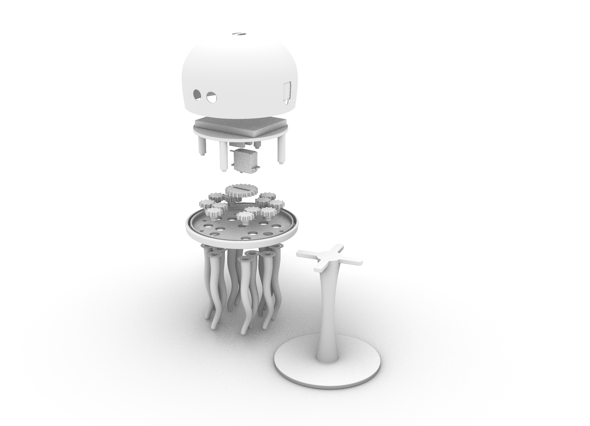

Although I was really doubtful about this project due to my lack of knowledge on microcontrollers, coding, and all; in the end it was a success and I had a good time working on it.

**Speculations**

This project led me to speculate that in the future, Digital Ecosystems will transform human experiences by creating more interactive and adaptive environments, reshaping how we engage with the world. Engineering will focus on designing intuitive, adaptable products that integrate evolving systems. AI will make these ecosystems smarter, predicting and responding to user behavior in real-time. Ultimately, projects like Jellyfish will seamlessly blend digital and physical interactions, potentially advancing into educational tools which would be a very interesting and engaging development. 

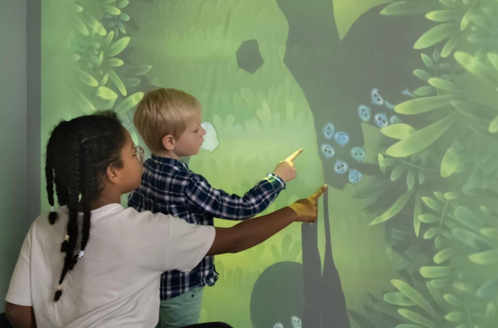

---

# Week 7: Report 7 #
## Week of 10/17/2024

**Reflection**

This week has been a lot of understanding and testing sensors, pieces, and designs. As a group, we have decided not to move forward with MaxcMSP and only focus on TouchDesigner which my teammates are working on. Here are the updated diagrams for the project. Apart from that, we are aiming to include all of the other pices to it so that our Jellyfish is able to vibrate, rotate its tentacles, and light up!

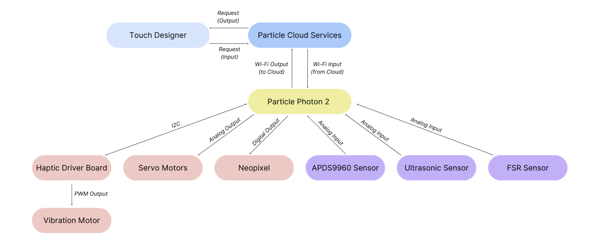
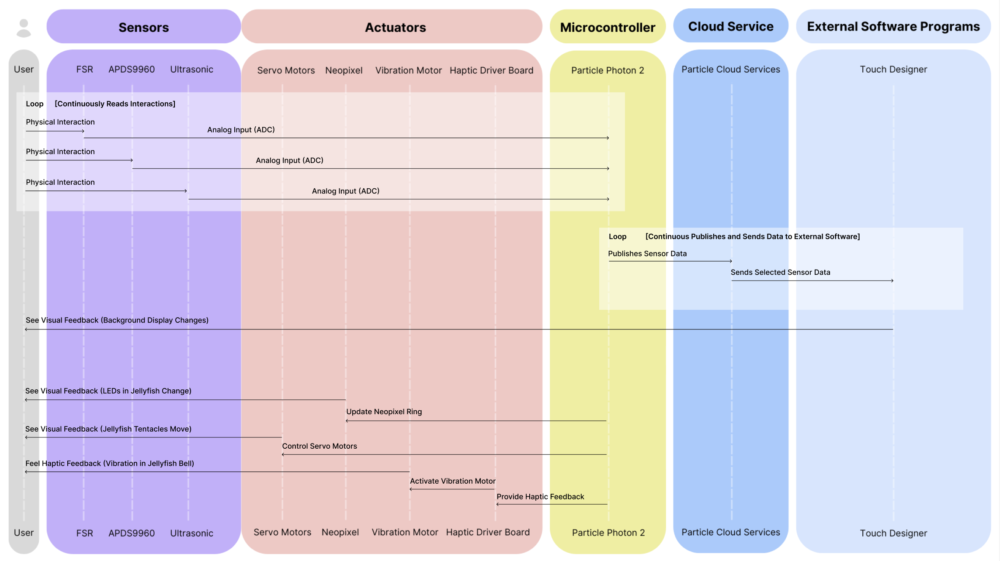

I measured and also looked at the specs of the different pieces we will be adding to our project to be able to see if these will fit inside the umbrella-shaped part of our Jellyfish (or the head). I have never worked with gears, nor modeled them so it has been hard to understand how these migth work an dwhat attachment will be added to the servo motor. I looked up various sites that have already modeled pieces and found that it was the best route to go with. I downlowaded stls, imported them into Rhino and have been messing around with them to adjust them and actually making them solids since they were only meshes. Still in the process of making it all fit together, modifying pieces. Here are pictures of the process. 

Still need to decided if we will go with regular PLA or resin. The lights might look best with resin, but the PLA might be a better choice if we make the shell thinner. If we use resin, makybe our components might be distacting to anyone interacting with the jellyfish, or it might be cool? Not sure. It is a TBD. 

**Speculations**

In the future (near future) I feel that these tools could perfectly be used in experimential and immersive education. Having interactive simulations in classrooms for learning purposes, will allow students to engage with complex concepts in a hands-on way. This could transform traditional learning environments into dynamic spaces.

As far as for our project, I speculate that if we had more time and expertise, we could use AI to adapt the jellyfish's responses based on user interactions. Integrating it with the Photon2 backdrop could create a cohesive system where both elements respond to each other, enhancing the overall experience. I am not a fan of AI, but it would definitely be a great addition to making this project above and beyond. 

---

# Week 6: Report 6 #
## Week of 10/10/2024

**Reflection**

Hello! This week, I soldered for the first time and worked with Visual Studio Code to play around with my photon2 device. I experimented with the demo firmware and I began exploring how to map sensor values to other processes in the firmware. I experimented with determining appropriate output ranges, particularly for controlling LED brightness based on sensor inputs. I am confident that my second project will have avarious range of sensors, so I am attempting to fet to know as many as I can and asking around what their applications are. Overall, I’m excited about my progress and starting to feel less scared to use the device, so I am eager to keep exploring the different aplication of this technology. 

Here are some pictures of the the stemma QT interface board that I soldered with a friend. I had never soldered before, but I got help and guidance from Kaylee on how to do it correctly! 

After doing that, I worked with the two stemma files: ACCEL/GYRO and potentionmeter to OLED. 

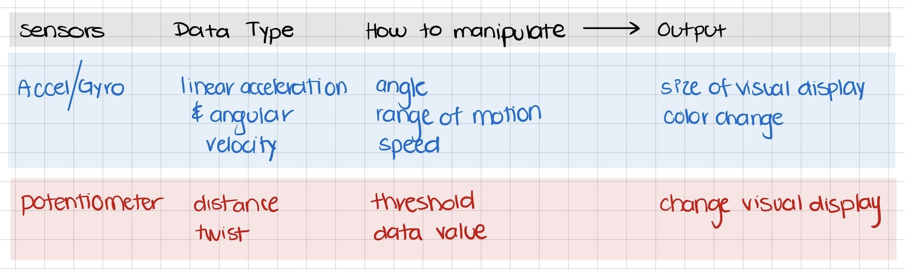

We also created our groups for Project 02 and I am very excited. I am working with Kaylee and Lauryn and we have though of created an interactive jellyfish (LED lights and motion) that also has an interactive backdrop made in TouchDesigner. Here is adiagrams of the pieces we will be putting together to make our project come to life!

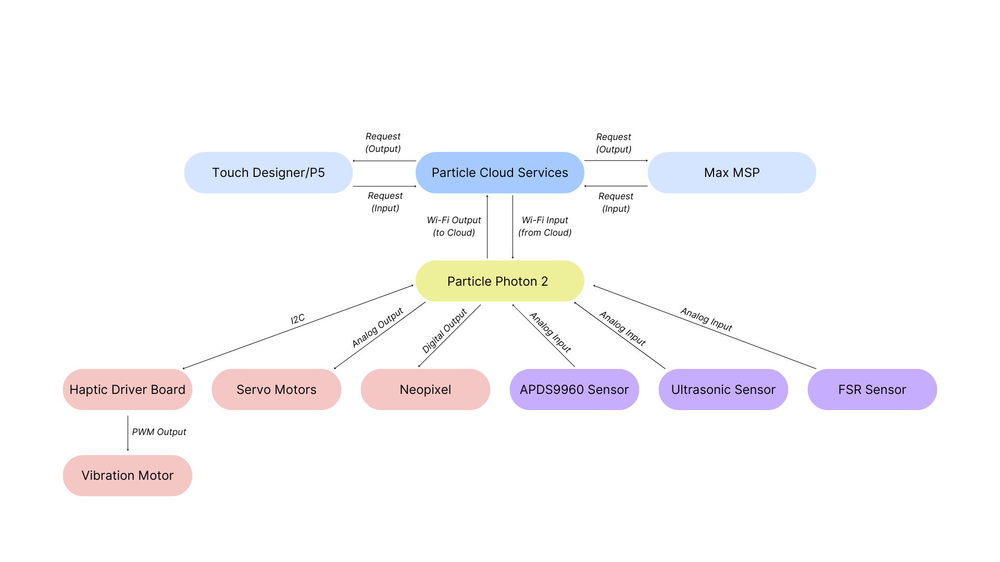

**Speculations**

Moving I sure that these tools have the possibility of being applied into a larger scope than what we are being taught. For example, involving other software platforms like TouchDesigner and MaxMSP to our project sounds so cool. 

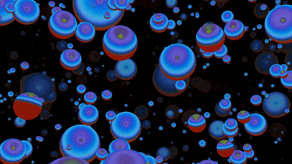

--- 

# Week 5: Report 5 #
## Week of 10/03/2024

**Reflection**

This week I had very limited time to work with the Photon as I had a family emergency and just got back to school. I did follow the tutorials, which personally are very hard to fully understand just because I am not familiar with coding, nor microcontrollers in general. I was able to follow examples in last week's class and was successful; the process of that  in class looked like this: 

This are the tutorials I did:

_**Tutorial #1: Button -> LED Pulse Rate**_

After building the circuit, I found it very insteresting on how the  the location of the cables did affect output of the code. I was able to place them all correctly and success! Afterwards, I went ahead and modified the code: changed the increment in which the LED Pulse flashes. 

_**Tutorial #2: FSR -> LED Color**_

In this next example I encountered a bit of an issue since I had not placed the cables correctly on the top left  part of the circuit. With guidance from a classmate, I was then able to correct it and moved the cables where they were supposed to go. I also found out that there needed to be a certain amount of pressure on the sensor to be able to change the LED color, because at the begiining I was not seeing any type of change other than the LED just lighting up. The colors I saw were Green and Red. 

_**Tutorial #3: Button Send on Change**_

This was very easy to build and very nice to see how my device was connected to the particle website. 

**Speculations**

I am interested in utilizing different sensors like ultrasonic and motion, and seeing how I can integrate the data into a future interactive project. I am also curious to explore the publish and subscribe functions, and how I can connect two photons and communicate data. I speculate that my future projects will include some interactivity and I am excited to explore how I can utilize the capabilities of two microcontrollers to augment and showcase data. 

This is an example of what I am particularly interested in: wearables, specifically in the health and wellness field! Trying to understand how these work would be amazing, even looking into flexible ones. 

Here is a great article that really caught my eye. Nick is a friend of mine who just graduated from Santa Clara University and his work around "Fluid Movement" is crazy. 

_https://www.scu.edu/news-and-events/feature-stories/2024/stories/fluid-movement.html_

---

# Week 4: Report 4 #
## Week of 09/26/2024

**Reflection**
Hello again! This week was very interesting since it was the first assignment I was submitting for the class. I was very nervous of how I showcased my design aesthetics and design thinking process through such a short video and word-heavy report. I feel that I am a good presenter that can pitch a product very well. But I am so harsh on myself that I always know or feel that there is something I coudl have done better. That is how I felt with my video, since I could not go back and add things like one would naturally do in a presentation which is much more flexible, but still "scripted". 

After watching all the videos and overall oroject of my classmates, I definitely learned that there I things that I can work on to have more successful projects. Now that this first project is done I am excited, but nervous of what is to come.

Additionally, I am very proud of my process of diagramming my first project in Figma, which really helped me understand hwo things in Grasshopper work vs. Rhino. Here is a snapshot of my process:

In class on Monday, I can say that I was little scared and lost. I have never heard or Arduino so I took a workshop a month or so ago so that I wouldn't feel lost in this second project, but I honestly didn't learn much. It was fast paced and basic, but still did not understand how it works. Now being introducd to our second project, I am thankful that it is in groups so I can get my peers to guide me through this learning process. I honestly didn't know the majrority of the terms in the lecture, so we will see how it goes. 

Here is my homework for this week along with the description of how and why I think that these two ecosystems in my life are connected to each other:

**Speculations**
Speculation of microcontrollers? Not sure, but hopefully the following things will happen:
 - Easier Development Tool: For these tools to have a more user-friendly software could be VERY good for people that do not have a backrgound to know about them. Tools for programming  microcontrollers will become _more intuitive_, with options that _don’t require deep coding skills_, making it easier for anyone to create projects. 
- Advanced Sensors: Microcontrollers might work with cooler sensors that will be developed to make devices smarter for health monitoring among others. _I have a great interest in wearable technology, medical devices, and just overall lifestyle snd wellbeing products and services._

Check out this cool startup I have been following an dbeen interested in for s while: https://www.nextiles.com

---

# Week 3: Report 3 #
## Week of 09/19/2024

**Reflection**
This week was very hectic, trying to understand everything from the project, figuring out what to design, actually using Grasshopper to create somehting I really wanted an already designed, and more! Here are a couple of pictures of the process of Project 01, along with the video I created for this:

Link: https://youtu.be/Aso4vXevdKo 

While I think this was a very fast paced project, I am still open to learning more about Grasshopper and excited to use it in a more complex manner, it will take me some time to grasp how these graphs and flow work. As a designer, it can be challenging not to manipulate my design directly like I can in Rhino or SolidWorks. I am happy to have discovered that leveraging Grasshopper allowed me to iterate and refine my ideas more effectively, improving my overall design process.

After doing my project and video, I wish I had showed more information of all the iterations it took for me to finally land on a design. It definelty was a longer process than what is shown on my video and would really like to get some tips on how to condense this information and be able to still showcase all that I want without leaving important things out. I would like to learn how to explain my diagrams easier on video while still stayingon the 3 min constraint. 

Here are some pictures of the different files created prior to defining the route I was gong to go with and while finding out what works for printing. When working on Grasshopper I found out it was way easier to iterate and doing all this process I did in Rhino while defining what was feasible to print, hold the candle, etc. 

I also feel very satisfied to have had the opportunity to help someo of my classmates with Rhino. It felt very nice to be able to give tips and tricks of the programs while others also shared tips and tricks for Grasshopper. 

**Speculations**
I would say that Rhino and Grasshopper will be affected by AI and upgrades in a very positive way. AI technology is advancing and it is very likely that programs like Rhino and Grasshopper will incorporate AI-driven tools that support optimizatio and automated workflows, letting designers/engineers to create complex and innovative solutions in a very efficient manner. Another thing that would be great to be incorporated int he near future would be cloud collaboration. Cloud-based platforms enable real-time collaboration anmong people and introducing it to these porgrams will facilitate teamwork across remote groups that need to work on projects simultaneously. This has pros and cons, since it can enhance productivity, creativity, and offer real-time feedback; yet it can also cause disputes within the same group. Still, it would be a very good addition to the programs. 

---

# Week 2: Report 2 #
## Week of 09/12/2024

**Reflection**
The homework assignment for this week was kind of confusing at first, but after a series of Grasshopper tutorials online and playing around with Grasshopper... I was able to understand the basics of the flow of how the program works (a little bit at least). I feel like it was helpful to mess around with the example files and see what changed in the model once altering the different parameters and baking. I have used Rhino before, so baking was not a term I was familiar with, but it makes sense when you model in Grasshopper that the object or whatever is being created is instantly tranfered into the Rhino file from the Grasshopper graph. While playing around, the program gave me an error once I edited the phone parameters to the actual dimensions of my phone. The center of gravity was off, the stand was not doing its desired function. Below are some picturs of my progress:

Here is a visual/diagram of what I understood from the example files of the phone stand:

And here is another visual of my thinking process while trying to create something: 

In class on Monday we had a Grasshopper demo that was more "clear" (still a work in progress to understand how it works) than many tutorials. I have still been watching tutorials that show some "tips and tricks" to helpe first time user get familiar with the commands and all you can do in the program. While it is still hard to grasp all the commands, paraments, etc. I am confident that I will learn how to do basic models soon. Here is a picture of the progress I made with the "live tutorial" that TJ led the other day...

I feel that I need more practice to figure out what is the gemometry (not sure this is the correct term) that is available in Grasshopper. I have had a difficult time differentiating between types of commands. For example, I want to do a a circle, but there are so many options... how do I know which one is the one I want? I feel that it will be a trial and error learning experience and then it will be total muscle memory. Fingers crossed! Very excited to develop this knowledge and skil in this new program. 

Examples: 

**Speculations**
Grasshopper seems very intimidating, but I do think this is a tool that can be used in different field in the future. It might be hard for deisgners ot go into Grasshopper after wprking with other programs before, but if someone that is very organized and visualizes a design or solution in a "graph" it will be a very helpful tool for them. Computational design tools are definetly growing and will help deisgners, engineers, etc. in the iteration and manufacturing processes of solutions.  

---

# Week 1: Report 1 #
## Week of 09/05/2024

**Reflection**
This week it was a mix of going back to basics and learning things. After a year or so of not being in a studio, using CAD, or physically prototypiong, it feels good to be back. After refreshing my knowledge on Rhino, laser cutting, and 3D printing, I decided to test out the laser cutter for this first week. 

I went the simple route creating coasters for my new apartment and they turned out pretty good! I worked in Rhino and then moved onto Illustartor, where I faced some issues with having a newer version of the program. With some guidance from Cody Glen, I was able to succesfully cut my coasters. See pictures of my design below!

After cutting the coasters I felt happy to be back in a workshop, yet felt the necessity to seal them/clear coat them to make these functional... here are some pictures of the process...

**Speculations**
Moving forward, I see myself working on very interesting projects and getting familiar with both old and new machines/tools. All the tools we are being offered and pushed to use seem to be very useful and purposeful for our future as designers. 

Additionally, I am very interested in the healthcare industry. Medical tech, wearables, everything related to it... I recently read on the news about this doctor in China who performed surgery on a patient from kilometers away. I really finds this fascinating, find the link below:

_https://www.hindustantimes.com/trending/doctor-removes-patient-s-lung-tumor-while-operating-machine-from-5-000-km-away-video-surfaces-101722674450882.html_
